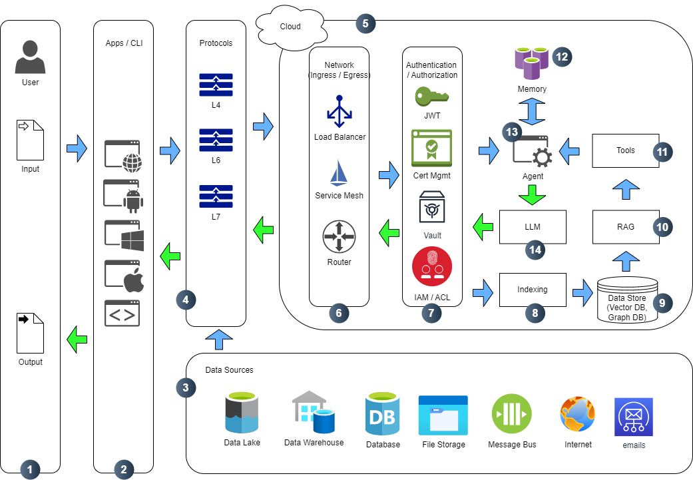

<!-- TOC start -->

- [AI Incident Response, V1.0 -- DRAFT](#ai-incident-response-v10----draft)
  - [OASIS Open Project : Coalition for Secure AI (CoSAI) - Workstream 2: Preparing Defenders for a Changing Cybersecurity Landscape](#oasis-open-project--coalition-for-secure-ai-cosai---workstream-2-preparing-defenders-for-a-changing-cybersecurity-landscape)
  - [1. Abstract](#1-abstract)
  - [2. How To Use This Document](#2-how-to-use-this-document)
  - [3. Executive Summary](#3-executive-summary)
    - [3.1. What challenges AI Systems pose to incident responders](#31-what-challenges-ai-systems-pose-to-incident-responders)
    - [3.1. What is Incident Response in Context of AI](#31-what-is-incident-response-in-context-of-ai)
  - [4. Common Architectural Patterns of AI Systems and Adversary Attacks](#4-common-architectural-patterns-of-ai-systems-and-adversary-attacks)
    - [4.1. Levels of Defense Surface](#41-levels-of-defense-surface)
    - [4.2. Technology Stack](#42-technology-stack)
    - [4.3. Architectural Patterns](#43-architectural-patterns)
      - [4.3.1. Basic LLM Architecture](#431-basic-llm-architecture)
        - [4.3.1.1. Overview](#4311-overview)
        - [4.3.1.2. ATLAS Techniques and Tactics](#4312-atlas-techniques-and-tactics)
        - [4.3.1.3. Mitigations](#4313-mitigations)
        - [4.3.1.4. Case Studies](#4314-case-studies)
      - [4.3.2. LLM Architecture with Memory](#432-llm-architecture-with-memory)
        - [4.3.2.1. Overview](#4321-overview)
        - [4.3.2.2. ATLAS Techniques and Tactics](#4322-atlas-techniques-and-tactics)
        - [4.3.2.3. Mitigations](#4323-mitigations)
        - [4.3.2.4. Case Studies](#4324-case-studies)
      - [4.3.3. RAG Architecture](#433-rag-architecture)
        - [4.3.3.1. Overview](#4331-overview)
        - [4.3.3.2. ATLAS Techniques and Tactics](#4332-atlas-techniques-and-tactics)
        - [4.3.3.3. Mitigations](#4333-mitigations)
        - [4.3.3.4. Case Studies](#4334-case-studies)
      - [4.3.4. Agentic Architecture](#434-agentic-architecture)
        - [4.3.4.1. Overview](#4341-overview)
        - [4.3.4.2. ATLAS Techniques and Tactics](#4342-atlas-techniques-and-tactics)
        - [4.3.4.3. Mitigations](#4343-mitigations)
        - [4.3.4.4. Case Studies](#4344-case-studies)
      - [4.3.5. Agentic RAG Architecture](#435-agentic-rag-architecture)
        - [4.3.5.1. Overview](#4351-overview)
        - [4.3.5.2. ATLAS Techniques and Tactics](#4352-atlas-techniques-and-tactics)
        - [4.3.5.3. Mitigations](#4353-mitigations)
        - [4.3.5.4. Case Studies](#4354-case-studies)
  - [5. Monitoring and Telemetry](#5-monitoring-and-telemetry)
  - [6. Incident Detection Methods](#6-incident-detection-methods)
  - [7. Incident Response Playbooks](#7-incident-response-playbooks)
    - [7.1. Roles and Responsibilities between provider and consumer of AI systems](#71-roles-and-responsibilities-between-provider-and-consumer-of-ai-systems)
    - [7.2. General Frameworks and Playbooks for AI Incident Response](#72-general-frameworks-and-playbooks-for-ai-incident-response)
      - [7.2.1. NIST SP 800-61r2 Computer Security Incident Handling Guide](#721-nist-sp-800-61r2-computer-security-incident-handling-guide)
        - [7.2.1.1. Key Concept](#7211-key-concept)
        - [7.2.1.2. Key Recommendations](#7212-key-recommendations)
        - [7.2.1.3. Takeaways for AI Incident Response](#7213-takeaways-for-ai-incident-response)
      - [7.2.2. OASIS CACAO Security Playbooks Version 2.0](#722-oasis-cacao-security-playbooks-version-20)
    - [7.3. Categories of AI Attacks](#73-categories-of-ai-attacks)
      - [7.3.1. Data-Level Incidents](#731-data-level-incidents)
      - [7.3.2. Model-Level Incidents](#732-model-level-incidents)
      - [7.3.3. Deployment-Level Incidents](#733-deployment-level-incidents)
      - [7.3.4. Output-Level Incidents](#734-output-level-incidents)
    - [7.4. Creating an AI Incident Response Plan](#74-creating-an-ai-incident-response-plan)
      - [7.4.1. Foundations of an AI Incident Response Plan](#741-foundations-of-an-ai-incident-response-plan)
      - [7.4.2. Pre-Incident Preparation](#742-pre-incident-preparation)
      - [7.4.3. Incident Response Workflow for AI Systems](#743-incident-response-workflow-for-ai-systems)
        - [7.4.3.1. Preparation Phase](#7431-preparation-phase)
        - [7.4.3.2. Detection and Analysis Phase](#7432-detection-and-analysis-phase)
        - [7.4.3.3. Containment, Eradication, and Recovery Phase](#7433-containment-eradication-and-recovery-phase)
        - [7.4.3.4. Post-Incident Activity Phase](#7434-post-incident-activity-phase)
        - [7.4.3.5. NIST Alignment Matrix](#7435-nist-alignment-matrix)
      - [7.4.4. Training and Simulation](#744-training-and-simulation)
      - [7.4.5. Integration Roadmap with Enterprise Security](#745-integration-roadmap-with-enterprise-security)
    - [7.5. Performing Forensics for an AI system](#75-performing-forensics-for-an-ai-system)
    - [7.6. Containment and Mitigations](#76-containment-and-mitigations)
    - [7.7. Communication to Govt/Regulatory agencies](#77-communication-to-govtregulatory-agencies)
    - [7.8. Sharing IoCs and TTPs back with community](#78-sharing-iocs-and-ttps-back-with-community)
  - [9. References](#9-references)
  - [10. Acknowledgements](#10-acknowledgements)
    - [10.1. Workstream Leads Chairs: WS Lead Chair Name (Chair.Name@example.com), Example Corp. (mailto: link for email address; http:// link for affiliation web site) (remove "s" from Chairs if one)](#101-workstream-leads-chairs-ws-lead-chair-name-chairnameexamplecom-example-corp-mailto-link-for-email-address-http-link-for-affiliation-web-site-remove-s-from-chairs-if-one)
    - [10.2. Editors: Editor Name (Editor.Name@example.com), Example Corp. (mailto: link for email address; http:// for affiliation web site) (remove "s" from Editors if just one)](#102-editors-editor-name-editornameexamplecom-example-corp-mailto-link-for-email-address-http-for-affiliation-web-site-remove-s-from-editors-if-just-one)
  - [11. Copyright Notice](#11-copyright-notice)

<!-- TOC end -->

# AI Incident Response, V1.0 -- DRAFT

## OASIS Open Project : [Coalition for Secure AI (CoSAI)](https://github.com/cosai-oasis) - [Workstream 2: Preparing Defenders for a Changing Cybersecurity Landscape](https://github.com/cosai-oasis/ws2-defenders)

## 1. Abstract
This paper addresses the topic of incident response in the context of AI systems. As with other materials produced by the Coalition for Secure AI, this paper focuses on technological capabilities and gaps that are specific to the field of articifical intelligence and does not address the topic of incident response in other contexts as this has been well-researched and documented by existing frameworks (such as [NIST Computer Security Incident Handling Guide](https://nvlpubs.nist.gov/nistpubs/SpecialPublications/NIST.SP.800-61r2.pdf). When AI systems are attacked and compromised, what are the specific steps that a defender should take to maximize auditability, resiliency, recovery, and hardening against the (successful) exploitation workflow? What proactive steps should a defender take to minimize the possibility of successful exploitation to begin with? Does the notion of a forensic investigation carry weight in AI Incident Response? Given that AI systems can put downward pressure on "explainability", does this tend to impact the effectiveness of IR activities? To what extent do agentic AI architectures complicate incident response, and are there specific steps to minimize or account for this complexity? These are examples of the types of questions that this paper will address.

 

## 2. How To Use This Document

## 3. Executive Summary

### 3.1. What challenges AI Systems pose to incident responders

### 3.1. What is Incident Response in Context of AI

Incident response in context of AI includes analysis of context of AI-enabled application, including user prompts, system prompts, configuration. The key security issue with AI systems is that the executable instructions and user supplied data are in the same blob. Thus in any security incident we need to focus on identifying attack points where this could have possibly been exploited. Further, AI systems are typicially non-deterministic systems, thus a simple code validation and verification does not work, the AI system can generate different outputs for the same inputs. Small variations in input data can lead to larger changes in the AI system output that could lead to potential bypass scenarios of implemented verification rules and restrictions.
All of this context creates additional set of requirements for logging and recording of AI system states. We also need completely new logic for interpreting security events occuring in the system. For example in chat bot scenarios all prompts (user and system) as well as AI system output must be logged in order to facilitate effective Incident Response process. We also need to be able to understand how these prompts led to specific AI system responses.

 

## 4. Common Architectural Patterns of AI Systems and Adversary Attacks

### 4.1. Levels of Defense Surface

 

  

 

| ***Level***                      | ***Description and Security Considerations***                                                                                             |
|----------------------------------|-------------------------------------------------------------------------------------------------------------------------------------------|
| **1. User**                      | End-users initiate queries and receive responses. Attackers may exploit social engineering, prompt injection, or feedback manipulation.   |
| **2. Apps / CLI**                | Interfaces like web UIs, chat apps, or CLI tools mediate user interaction. Requires input validation and UI hardening.                    |
| **3. Data Sources**              | Document repositories, APIs, or third-party feeds. Poisoned/unvetted data can corrupt retrieval and generation.                           |
| **4. Network Protocols**         | Transport layer (e.g., TCP, HTTP, gRPC) for internal and external communication. Needs encryption and rate-limiting.                           |
| **5. Cloud Infrastructure**      | Underlying compute, storage, and orchestration platform. Risk of API exposure and misconfiguration.                                       |
| **6. Network Ingress/Egress**    | Controls external/internal traffic. Must apply firewalling, segmentation, and flow logging.                                               |
| **7. AuthN / AuthZ Layer**       | Governs identity and permissions for users, agents, and tools. Critical for preventing privilege misuse or agent takeover.                |
| **8. Indexing / Embedding**      | Processes documents into chunks and embeddings or graphs. Targeted for data poisoning or injection.                                       |
| **9. Data Store (Vector/Graph DB)** | Stores semantic vectors or knowledge graphs. Susceptible to poisoning, exfiltration, or unauthorized writes.                           |
| **10. RAG**                      | Retrieves context to augment prompts. Poisoned context leads to flawed generation and decision-making.                                    |
| **11. Tools**                    | External APIs, web search, code execution, etc. Can be misused for unintended actions or data exfiltration.                               |
| **12. Memory**                   | Stores persistent interaction history and planning states. Poisoning memory alters long-term behavior.                                    |
| **13. Agent**                    | Coordinates planning, retrieval, memory, and tool use. Susceptible to reasoning attacks and prompt hijacking.                             |
| **14. LLM**                      | Generates natural language and decisions. Must be protected from prompt injection, model extraction, and inference abuse.                 |

 

### 4.2. Technology Stack

 

  

 

| ***Stack Area***        | ***Description***             | ***Potential Security Risks***    |
|-------------------------|-------------------------------|-----------------------------------|
| **LLMs**               | Core large language models that generate responses, decisions, and plans based on input prompts.         | Prompt injection, model extraction via probing, adversarial reasoning or output manipulation. |
| **Embedding**          | Converts documents and queries into vector representations for similarity-based retrieval.               | Embedding poisoning, semantic drift, sensitive data leakage via vector queries.               |
| **Frameworks**         | Orchestration libraries enabling agent behavior, prompt chaining, tool use, and memory integration.       | Tool invocation abuse, insecure chaining, uncontrolled agent autonomy, insufficient isolation.|
| **Data Extraction**    | Pipelines that extract and preprocess content (text, structured, semi-structured) for indexing.           | Injection via malformed content, malicious payloads, evasion of parsing or sanitization.      |
| **Open LLM Access**    | APIs and endpoints that connect to remote LLM inference services or expose hosted open-source models.     | API key leakage, quota abuse, unauthorized model access or fine-tuning, man-in-the-middle risks.|
| **Evaluation**         | Systems for benchmarking agent output quality, behavior logging, and safety observation.                  | Leakage of sensitive data, insufficient adversarial testing, evaluation blind spots.           |
| **Vector Databases**   | Databases that store embeddings and allow semantic search or nearest-neighbor retrieval.                  | Poisoned vectors, unauthorized read/write, inference attacks through crafted query vectors.    |

 

### 4.3. Architectural Patterns

#### 4.3.1. Basic LLM Architecture

 

  

 

##### 4.3.1.1. Overview

| ***Component***                  | ***Description***                                                                                      |
|-------------------------------|--------------------------------------------------------------------------------------------------------|
| **1. Infrastructure**            | The cloud or on-premise compute environment hosting the LLM inference service and surrounding systems. |
| **2. LLM Model**                 | The core pretrained language model (e.g., GPT, LLaMA, PaLM) that generates text based on user input.   |
| **3. Information Sources**       | External static or dynamic data injected into the LLM prompt, such as reference text or documents.     |
| **4. Generated Output & Feedback** | Text output generated by the LLM, and any follow-up user feedback used to guide or evaluate performance.|
| **5. Application Interfaces**    | The user-facing UI or API (web, chat, CLI) that captures input, displays responses, and manages flow. |
| **6. LLM Tools & Frameworks**    | Supporting SDKs, APIs, libraries (e.g., LangChain, Transformers) enabling prompt building and handling.|

 

##### 4.3.1.2. ATLAS Techniques and Tactics

| ***LLM Architecture Component***     | ***ATLAS Tactics***   | ***Relevant ATLAS Techniques***  | ***Impact Summary***  |
|--------------------------------|-----------------|----------------------------|-----------------|
| **1. Infrastructure**                | Evasion (TA1001), Reconnaissance (TA1002)            | Model Evasion (AT1010), Model Extraction (AT1005), Adversarial Example Generation (AT1020)                         | Target model runtime and infrastructure for evasion, or extract via side channels.              |
| **2. LLM Models**                    | Poisoning (TA1003), Extraction (TA1004)              | Model Poisoning (AT1030), Model Inversion (AT1040), Model Extraction (AT1005)                                       | Tamper with model weights or extract internals via repeated queries or inversion attacks.       |
| **3. Information Sources**           | Poisoning (TA1003), Reconnaissance (TA1002)          | Data Poisoning (AT1050), Data Injection (AT1051), Input Manipulation (AT1060)                                       | Compromise external data sources to influence retrieval or context injection.                   |
| **4. Generated Output and Feedback** | Manipulation (TA1005), Influence Operations (TA1006) | Prompt Injection (AT1070), Output Manipulation (AT1080), Feedback Loop Attacks (AT1081)                             | Misuse feedback channels to alter or skew model behavior through prompt or interaction manipulation. |
| **5. LLM Tools and Frameworks**      | Execution (TA1007), Manipulation (TA1005)            | Tool Abuse (AT1090), Agent Manipulation (AT1091), API Abuse (AT1100)                                                | Compromise integrated tools or frameworks for unauthorized actions or misaligned outputs.       |
| **6. Application Interfaces**        | Manipulation (TA1005), Initial Access (TA1008)       | Prompt Injection (AT1070), UI Redress Attacks (AT1110), Input Manipulation (AT1060)                                 | Exploit user interfaces to inject malicious prompts or hijack interactions.                     |

 

##### 4.3.1.3. Mitigations

| ***Component***   | ***Threat Summary***  | ***Key Mitigations*** |
|-------------|-----------------|-----------------|
| **1. Infrastructure**             | Susceptible to adversarial inference (evasion) and information leakage.                | Execution prevention, network segmentation, runtime isolation.                                      |
| **2. LLM Models**                 | Vulnerable to poisoning, inversion, and extraction through crafted inputs.             | Model hardening, differential privacy, adversarial training, rate limiting.                         |
| **3. Information Sources**        | Can be manipulated to inject biased or malicious context.                              | Input filtering, data source whitelisting, validation pipelines.                                    |
| **4. Generated Output & Feedback** | Exposed to prompt injection, feedback loops, and output drift.                         | Prompt hardening, anomaly detection, output filtering, audit logging.                               |
| **5. LLM Tools and Frameworks**   | May be exploited through plugin misuse or agent misalignment.                          | Least privilege tool execution, command tracing, policy enforcement.                                |
| **6. Application Interfaces**     | Entry point for prompt injection, redress, and social engineering.                     | UI input validation, safe prompt templates, user guidance and training.                             |

 

##### 4.3.1.4. Case Studies

[https://sysdig.com/blog/llmjacking-stolen-cloud-credentials-used-in-new-ai-attack/](https://sysdig.com/blog/llmjacking-stolen-cloud-credentials-used-in-new-ai-attack/)

#### 4.3.2. LLM Architecture with Memory

 

  

 

##### 4.3.2.1. Overview

| ***Component***                  | ***Description***                                                                                      |
|-------------------------------|--------------------------------------------------------------------------------------------------------|
| **1. Infrastructure**            | The cloud or on-premise compute environment hosting the LLM inference service and surrounding systems. |
| **2. LLM Model**                 | The core pretrained language model (e.g., GPT, LLaMA, PaLM) that generates text based on user input.   |
| **3. Information Sources**       | External static or dynamic data injected into the LLM prompt, such as reference text or documents.     |
| **4. Generated Output & Feedback** | Text output generated by the LLM, and any follow-up user feedback used to guide or evaluate performance.|
| **5. Application Interfaces**    | The user-facing UI or API (web, chat, CLI) that captures input, displays responses, and manages flow. |
| **6. LLM Tools & Frameworks**    | Supporting SDKs, APIs, libraries (e.g., LangChain, Transformers) enabling prompt building and handling.|
| **7. Memory Storage**            | Persistent or session-based memory where contextual elements or user interaction history are stored.     |
| **8. Memory Retrieval** | Logic or tools responsible for selecting relevant past information and injecting it into new prompts.  |

##### 4.3.2.2. ATLAS Techniques and Tactics

| ***LLM Architecture Component***     | ***ATLAS Tactics***   | ***Relevant ATLAS Techniques***  | ***Impact Summary***  |
|--------------------------------|-----------------|----------------------------|-----------------|
| **1. Infrastructure**                | Evasion (TA1001), Reconnaissance (TA1002)            | Model Evasion (AT1010), Model Extraction (AT1005), Adversarial Example Generation (AT1020)                         | Target model runtime and infrastructure for evasion, or extract via side channels.              |
| **2. LLM Models**                    | Poisoning (TA1003), Extraction (TA1004)              | Model Poisoning (AT1030), Model Inversion (AT1040), Model Extraction (AT1005)                                       | Tamper with model weights or extract internals via repeated queries or inversion attacks.       |
| **3. Information Sources**           | Poisoning (TA1003), Reconnaissance (TA1002)          | Data Poisoning (AT1050), Data Injection (AT1051), Input Manipulation (AT1060)                                       | Compromise external data sources to influence retrieval or context injection.                   |
| **4. Generated Output and Feedback** | Manipulation (TA1005), Influence Operations (TA1006) | Prompt Injection (AT1070), Output Manipulation (AT1080), Feedback Loop Attacks (AT1081)                             | Misuse feedback channels to alter or skew model behavior through prompt or interaction manipulation. |
| **5. LLM Tools and Frameworks**      | Execution (TA1007), Manipulation (TA1005)            | Tool Abuse (AT1090), Agent Manipulation (AT1091), API Abuse (AT1100)                                                | Compromise integrated tools or frameworks for unauthorized actions or misaligned outputs.       |
| **6. Application Interfaces**        | Manipulation (TA1005), Initial Access (TA1008)       | Prompt Injection (AT1070), UI Redress Attacks (AT1110), Input Manipulation (AT1060)                                 | Exploit user interfaces to inject malicious prompts or hijack interactions.                     |
| **7. Memory Storage**                | Poisoning (TA1003), Extraction (TA1004)              | Data Poisoning (AT1050), Model Inversion (AT1040), Extraction (AT1005)                                              | Poison or exfiltrate persistent memory to manipulate long-term model behavior or extract info.  |
| **8. Memory Retrieval**   | Reconnaissance (TA1002), Manipulation (TA1005)       | Reconnaissance (AT1002), Prompt Injection (AT1070), Feedback Loop Attacks (AT1081)                                  | Target memory query mechanisms to infer stored data or manipulate what the model recalls.       |

 

##### 4.3.2.3. Mitigations

| ***Component***   | ***Threat Summary***  | ***Key Mitigations*** |
|-------------|-----------------|-----------------|
| **1. Infrastructure**             | Susceptible to model evasion or extraction via timing or side-channel inference.       | Network segmentation, execution prevention, endpoint isolation.                                     |
| **2. LLM Models**                 | Exposed to model poisoning, inversion, or extraction via repeated queries.             | Model hardening, differential privacy, adversarial training, query throttling.                      |
| **3. Information Sources**        | Manipulated to feed malicious or biased context to the model.                         | Data validation and whitelisting, content filtering, input sanitation.                              |
| **4. Generated Output & Feedback** | Vulnerable to prompt injection, feedback loop manipulation, and hallucination chaining.| Output filtering, feedback auditing, semantic plausibility checks.                                  |
| **5. LLM Tools and Frameworks**   | May be misused via prompt exploits or agent misrouting.                               | Tool permission restrictions, traceable execution, least-privilege configuration.                   |
| **6. Application Interfaces**     | Entry point for prompt injection, UI redress, and social engineering attacks.         | Prompt hardening, input validation, secure UI design, user education.                               |
| **7. Memory Storage**             | Exposed to poisoning or exfiltration of long-term stored information.                 | Session expiration, access controls, integrity and consistency checks.                              |
| **8. Memory Retrieval** | Exploitable to retrieve sensitive history or bias model outputs.                      | Query filtering, access monitoring, memory auditing, anonymization.                                 |

 

##### 4.3.2.4. Case Studies

#### 4.3.3. RAG Architecture

 

  

 

##### 4.3.3.1. Overview

| ***Component***                  | ***Description***                                                                                          |
|-------------------------------|----------------------------------------------------------------------------------------------------------|
| **1. Infrastructure**            | The compute environment for hosting the LLM, retriever, and storage systems (e.g., cloud, hybrid).       |
| **2. LLM Model**                 | The pretrained language model responsible for generating answers based on retrieved context.             |
| **3. Information Sources**       | External static or dynamic data injected into the LLM prompt, such as reference text or documents.     |
| **4. Generated Output & Feedback** | Final LLM-generated response and optional user feedback loop used to refine future responses.           |
| **5. Application Interfaces**           | User-facing input layer or API endpoint for accepting natural language queries.                          |
| **6. Retrieval System**          | Middleware that interprets queries and fetches relevant documents from external sources.                 |
| **7. Data Store**           | Storage layer for dense vector embeddings used to perform semantic similarity searches. May include graph storage if knowledge graph generation is part of the architecture. |
| **8. Data Sources**            | Original documents (text, PDFs, webpages) used to build embeddings and provide source context.           |
| **9. Memory Store & Retrieval**              | Optional session-based or persistent memory used to track user interactions or prior contexts.           |
| **10. LLM & RAG Tools**              | Supporting SDKs, APIs, libraries (e.g., LangChain, Transformers, Neo4j) enabling prompt and RAG building and handling.           |
| **11. RAG Indexing**               | Pipeline for extracting, chunking, and embedding raw content; may also construct knowledge graphs.            |

##### 4.3.3.2. ATLAS Techniques and Tactics

| ***LLM Architecture Component***     | ***ATLAS Tactics***   | ***Relevant ATLAS Techniques***  | ***Impact Summary***  |
|--------------------------------|-----------------|----------------------------|-----------------|
| **1. Infrastructure**                | Evasion (TA1001), Reconnaissance (TA1002)            | Model Evasion (AT1010), Model Extraction (AT1005), Adversarial Example Generation (AT1020)                         | Target model infrastructure for evasion or data extraction via side-channel and inference.       |
| **2. LLM Model**                     | Poisoning (TA1003), Extraction (TA1004)              | Model Poisoning (AT1030), Model Inversion (AT1040), Model Extraction (AT1005)                                       | Compromise model fidelity through poisoning or extract sensitive data through repeated probing. |
| **3. Information Sources**           | Poisoning (TA1003), Reconnaissance (TA1002)          | Data Poisoning (AT1050), Data Injection (AT1051), Input Manipulation (AT1060)                                       | Compromise external data sources to influence retrieval or context injection.                   |
| **4. Generated Output and Feedback** | Manipulation (TA1005), Influence Operations (TA1006) | Prompt Injection (AT1070), Output Manipulation (AT1080), Feedback Loop Attacks (AT1081)                             | Alter model behavior using malicious feedback loops or prompt chaining attacks.                 |
| **5. Application Interfaces**               | Initial Access (TA1008), Manipulation (TA1005)       | UI Redress Attacks (AT1110), Prompt Injection (AT1070), API Abuse (AT1100)                                          | Exploit user interfaces or APIs to inject malicious prompts or hijack workflows.                |
| **6. Retrieval System**              | Reconnaissance (TA1002), Poisoning (TA1003)          | Reconnaissance (AT1002), Data Poisoning (AT1050), Input Manipulation (AT1060)                                       | Manipulate retrieval logic to feed biased or malicious results to the LLM.                       |
| **7. Data Store**               | Poisoning (TA1003), Extraction (TA1004)              | Data Poisoning (AT1050), Model Inversion (AT1040), Extraction (AT1005)                                              | Tamper with embeddings to degrade relevance or extract stored vectors.                          |
| **8. Data Sources**                | Poisoning (TA1003), Manipulation (TA1005)            | Data Injection (AT1051), Output Manipulation (AT1080), Prompt Injection (AT1070)                                    | Insert or manipulate documents to influence the grounding context of the LLM.                   |
| **9. Memory Store & Retrieval**                  | Extraction (TA1004), Manipulation (TA1005)           | Model Inversion (AT1040), Feedback Loop Attacks (AT1081), Data Poisoning (AT1050)                                   | Manipulate memory for long-term influence or to exfiltrate retrieved content.                   |
| **10. LLM & RAG Tools**               | Execution (TA1007), Manipulation (TA1005)          | Tool Abuse (AT1090), API Abuse (AT1100), Agent Manipulation (AT1091)                      | Misuse orchestration or plugin tools to execute unintended commands or bypass validation.       |
| **11. RAG Indexing**                  | Poisoning (TA1003), Manipulation (TA1005)          | Data Injection (AT1051), Prompt Injection (AT1070), Output Manipulation (AT1080)          | Poison document content or embedding structure during preprocessing and chunking stages.        |

 

##### 4.3.3.3. Mitigations

| ***Component***   | ***Threat Summary***  | ***Key Mitigations*** |
|-------------|-----------------|-----------------|
| **1. Infrastructure**         | Susceptible to timing attacks or inference evasion during LLM-query execution.         | Network segmentation, isolated compute environments, endpoint protection.                           |
| **2. LLM Model**              | Targeted by model extraction, inversion, or poisoning via crafted queries.             | Model hardening, differential privacy, API rate limiting and token control.                         |
| **3. Information Sources**        | Manipulated to feed malicious or biased context to the model.                         | Data validation and whitelisting, content filtering, input sanitation.                              |
| **4. Generated Output & Feedback** | Subject to hallucination amplification or feedback loop manipulation.             | Post-generation filtering, output feedback audits, semantic anomaly detection.                     |
| **5. Application Interfaces**        | Entry point for prompt injection, unauthorized queries, or redress attacks.           | Input sanitation and prompt control, UI hardening, throttling and access validation.               |
| **6. Retrieval System**       | Can be manipulated to feed biased or malicious documents into context.                | Context validation, use of vetted retrievers, document scoring and source whitelisting.            |
| **7. Data Store**        | Susceptible to adversarial embedding poisoning and semantic leakage.                  | Integrity checks, rate-limited embedding operations, access control.                                |
| **8. Data Sources**         | Can be used to inject hostile or misleading documents into retrieval context.         | Document validation, ingestion pipeline verification, source authenticity checks.                   |
| **9. Memory Store & Retrieval**          | Exploitable for long-term poisoning or sensitive history retrieval.                   | Memory expiration policies, anonymization, access logging.                                          |
| **10. LLM & RAG Tools**        | Tool plugins or orchestration layers may be hijacked or misused by prompt injection.  | Tool access control, sandboxing, execution monitoring, scope restriction. |
| **11. RAG Indexing**           | Poisoned during document chunking, embedding, or graph construction.                   | Input validation, semantic filters, isolated indexing pipelines, human-in-the-loop vetting.        |

 

##### 4.3.3.4. Case Studies

Financial Transaction Hijacking with M365 Copilot as an Insider: https://atlas.mitre.org/studies/AML.CS0026, https://labs.zenity.io/p/techniques-from-zenitys-genai-attacks-matrix-incorporated-into-mitre-atlas-to-track-emerging-ai-thr

#### 4.3.4. Agentic Architecture

 

  

 

##### 4.3.4.1. Overview

| ***Component***                   | ***Description***                                                                                              |
|--------------------------------|--------------------------------------------------------------------------------------------------------------|
| **1. Infrastructure**             | The underlying compute and orchestration environment enabling secure, scalable agent operations.             |
| **2. LLM Core Model**             | The foundational language model responsible for reasoning, planning, and generating text-based decisions.     |
| **3. Information Sources**       | External static or dynamic data injected into the LLM prompt, such as reference text or documents.     |
| **4. Agent Framework / Executor** | The runtime logic or engine that interprets plans and executes actions, typically via tools or APIs.         |
| **5. Planning Module**            | Component responsible for multi-step reasoning, goal formulation, and task decomposition.                     |
| **6. Tools** | External tools, APIs, or services that agents invoke to accomplish tasks (e.g., web search, databases).     |
| **7. Memory System**              | Persistent or temporary store of historical interactions, decisions, and results, used to maintain context.  |
| **8. Observation and Feedback Loop** | Mechanism by which the agent monitors its environment and adjusts future behavior based on outcomes.        |
| **9. Application Interface**| User interface or communication layer enabling users to interact with, supervise, or guide the agent.         |
| **10. Generated Output & Feedback** | Final LLM-generated response and optional user feedback loop used to refine future responses.           |

##### 4.3.4.2. ATLAS Techniques and Tactics

| ***LLM Architecture Component***     | ***ATLAS Tactics***   | ***Relevant ATLAS Techniques***  | ***Impact Summary***  |
|--------------------------------|-----------------|----------------------------|-----------------|
| **1. Infrastructure**                    | Evasion (TA1001), Reconnaissance (TA1002)            | Model Evasion (AT1010), Adversarial Example Generation (AT1020), Model Extraction (AT1005)                         | Target system infrastructure or exploit timing-based behaviors to extract data or trigger evasion. |
| **2. LLM Core Model**                    | Poisoning (TA1003), Extraction (TA1004)              | Model Poisoning (AT1030), Model Inversion (AT1040), Model Extraction (AT1005)                                       | Compromise model weights to bias agentic behavior or extract sensitive training data.           |
| **3. Information Sources**           | Poisoning (TA1003), Reconnaissance (TA1002)          | Data Poisoning (AT1050), Data Injection (AT1051), Input Manipulation (AT1060)                                       | Compromise external data sources to influence retrieval or context injection.                   |
| **4. Agent Framework/Executor**         | Execution (TA1007), Manipulation (TA1005)            | Tool Abuse (AT1090), Agent Manipulation (AT1091), API Abuse (AT1100)                                                | Abuse agent execution logic to perform unauthorized actions or cause cascading effects.         |
| **5. Planning Module**                  | Manipulation (TA1005), Influence Operations (TA1006) | Prompt Injection (AT1070), Output Manipulation (AT1080), Feedback Loop Attacks (AT1081)                             | Manipulate planning or decision-making through adversarial prompts or recursive attacks.        |
| **6. Tools**   | Initial Access (TA1008), Execution (TA1007)          | API Abuse (AT1100), Tool Abuse (AT1090), UI Redress Attacks (AT1110)                                                | Exploit tool connections or APIs to execute unintended commands or leak sensitive outputs.      |
| **7. Memory System**                    | Poisoning (TA1003), Extraction (TA1004)              | Model Inversion (AT1040), Data Poisoning (AT1050), Feedback Loop Attacks (AT1081)                                   | Corrupt memory to manipulate long-term planning or to exfiltrate contextual data.               |
| **8. Observation and Feedback System** | Manipulation (TA1005), Influence Operations (TA1006) | Prompt Injection (AT1070), Output Manipulation (AT1080), Observation Poisoning (AT1120)                             | Influence observational input or feedback loops to derail agent behavior or learning.           |
| **9. Application Interfaces**      | Initial Access (TA1008), Manipulation (TA1005)       | UI Redress Attacks (AT1110), Prompt Injection (AT1070), Input Manipulation (AT1060)                                 | Use social engineering or UI manipulation to inject commands or override human alignment interfaces. |
| **10. Generated Output and Feedback** | Manipulation (TA1005), Influence Operations (TA1006) | Prompt Injection (AT1070), Output Manipulation (AT1080), Feedback Loop Attacks (AT1081)                             | Alter model behavior using malicious feedback loops or prompt chaining attacks.                 |

 

##### 4.3.4.3. Mitigations

| ***Component***   | ***Threat Summary***  | ***Key Mitigations*** |
|-------------|-----------------|-----------------|
| **1. Infrastructure**             | Susceptible to side-channel attacks, resource abuse, or unauthorized agent deployments. | Endpoint protection, network segmentation, execution isolation.                                     |
| **2. LLM Core Model**             | Targeted by model poisoning, extraction, or inversion via reasoning paths.              | Model hardening, differential privacy, adversarial training techniques.                             |
| **3. Information Sources**        | Manipulated to feed malicious or biased context to the model.                         | Data validation and whitelisting, content filtering, input sanitation.                              |
| **4. Agent Framework/Executor**   | Vulnerable to tool abuse or action redirection via manipulated reasoning outputs.       | Action permission boundaries, tool sandboxing, execution auditing.                                  |
| **5. Planning Module**            | Susceptible to prompt chaining and decision manipulation via nested reasoning loops.    | Prompt input validation, chain-of-thought validation, recursive output monitoring.                  |
| **6. Tools**   | May be hijacked for unintended actions or remote access.                                | Tool invocation restrictions, API access control, least privilege configurations.                   |
| **7. Memory System**              | Long-term poisoning or recall manipulation can skew agent behavior across sessions.     | Session-bound memory, validation and trimming, expiration and anonymization.                        |
| **8. Observation/Feedback Loop**  | Can be manipulated via fake observations or altered action-reaction patterns.           | Feedback auditing, observability tooling, semantic plausibility filters.                            |
| **9. Application Interfaces** | Entry point for prompt injection, social engineering, and agent hijack attempts.        | UI redress defense, prompt hardening, secure templates, user education.                             |
| **10. Generated Output & Feedback** | Subject to hallucination amplification or feedback loop manipulation.             | Post-generation filtering, output feedback audits, semantic anomaly detection.                     |

 

##### 4.3.4.4. Case Studies

#### 4.3.5. Agentic RAG Architecture

 

  

 

##### 4.3.5.1. Overview

| ***Component***                   | ***Description***                                                                                              |
|--------------------------------|--------------------------------------------------------------------------------------------------------------|
| **1. Infrastructure**             | The underlying compute and orchestration environment enabling secure, scalable agent operations.             |
| **2. LLM Core Model**             | The foundational language model responsible for reasoning, planning, and generating text-based decisions.     |
| **3. Information Sources**       | External static or dynamic data injected into the LLM prompt, such as reference text or documents.     |
| **4. Agent Framework / Executor** | The runtime logic or engine that interprets plans and executes actions, typically via tools or APIs.         |
| **5. Planning Module**            | Component responsible for multi-step reasoning, goal formulation, and task decomposition.                     |
| **6. Tools** | External tools, APIs, or services that agents invoke to accomplish tasks (e.g., web search, databases).     |
| **7. Memory System**              | Persistent or temporary store of historical interactions, decisions, and results, used to maintain context.  |
| **8. Observation and Feedback Loop** | Mechanism by which the agent monitors its environment and adjusts future behavior based on outcomes.        |
| **9. Application Interface**| User interface or communication layer enabling users to interact with, supervise, or guide the agent.         |
| **10. Generated Output & Feedback** | Final LLM-generated response and optional user feedback loop used to refine future responses.           |
| **11. Retrieval System**          | Middleware that interprets queries and fetches relevant documents from external sources.                 |
| **12. Data Store**           | Storage layer for dense vector embeddings used to perform semantic similarity searches. May include graph storage if knowledge graph generation is part of the architecture.   |
| **13. Data Sources**            | Original documents (text, PDFs, webpages) used to build embeddings and provide source context.           |
| **14. RAG Tools**              | Supporting SDKs, APIs, libraries (e.g., Neo4j, Chroma) enabling RAG building and handling.  |
| **15. RAG Indexing**               | Pipeline for extracting, chunking, and embedding raw content; may also construct knowledge graphs.            |

##### 4.3.5.2. ATLAS Techniques and Tactics

| ***LLM Architecture Component***     | ***ATLAS Tactics***   | ***Relevant ATLAS Techniques***  | ***Impact Summary***  |
|--------------------------------|-----------------|----------------------------|-----------------|
| **1. Infrastructure**                    | Evasion (TA1001), Reconnaissance (TA1002)            | Model Evasion (AT1010), Adversarial Example Generation (AT1020), Model Extraction (AT1005)                         | Target system infrastructure or exploit timing-based behaviors to extract data or trigger evasion. |
| **2. LLM Core Model**                    | Poisoning (TA1003), Extraction (TA1004)              | Model Poisoning (AT1030), Model Inversion (AT1040), Model Extraction (AT1005)                                       | Compromise model weights to bias agentic behavior or extract sensitive training data.           |
| **3. Information Sources**           | Poisoning (TA1003), Reconnaissance (TA1002)          | Data Poisoning (AT1050), Data Injection (AT1051), Input Manipulation (AT1060)                                       | Compromise external data sources to influence retrieval or context injection.                   |
| **4. Agent Framework/Executor**         | Execution (TA1007), Manipulation (TA1005)            | Tool Abuse (AT1090), Agent Manipulation (AT1091), API Abuse (AT1100)                                                | Abuse agent execution logic to perform unauthorized actions or cause cascading effects.         |
| **5. Planning Module**                  | Manipulation (TA1005), Influence Operations (TA1006) | Prompt Injection (AT1070), Output Manipulation (AT1080), Feedback Loop Attacks (AT1081)                             | Manipulate planning or decision-making through adversarial prompts or recursive attacks.        |
| **6. Tools**   | Initial Access (TA1008), Execution (TA1007)          | API Abuse (AT1100), Tool Abuse (AT1090), UI Redress Attacks (AT1110)                                                | Exploit tool connections or APIs to execute unintended commands or leak sensitive outputs.      |
| **7. Memory System**                    | Poisoning (TA1003), Extraction (TA1004)              | Model Inversion (AT1040), Data Poisoning (AT1050), Feedback Loop Attacks (AT1081)                                   | Corrupt memory to manipulate long-term planning or to exfiltrate contextual data.               |
| **8. Observation and Feedback System** | Manipulation (TA1005), Influence Operations (TA1006) | Prompt Injection (AT1070), Output Manipulation (AT1080), Observation Poisoning (AT1120)                             | Influence observational input or feedback loops to derail agent behavior or learning.           |
| **9. Application Interfaces**      | Initial Access (TA1008), Manipulation (TA1005)       | UI Redress Attacks (AT1110), Prompt Injection (AT1070), Input Manipulation (AT1060)                                 | Use social engineering or UI manipulation to inject commands or override human alignment interfaces. |
| **10. Generated Output and Feedback** | Manipulation (TA1005), Influence Operations (TA1006) | Prompt Injection (AT1070), Output Manipulation (AT1080), Feedback Loop Attacks (AT1081)                             | Alter model behavior using malicious feedback loops or prompt chaining attacks.                 |
| **11. Retrieval System**              | Reconnaissance (TA1002), Poisoning (TA1003)          | Reconnaissance (AT1002), Data Poisoning (AT1050), Input Manipulation (AT1060)                                       | Manipulate retrieval logic to feed biased or malicious results to the LLM.                       |
| **12. Data Store**               | Poisoning (TA1003), Extraction (TA1004)              | Data Poisoning (AT1050), Model Inversion (AT1040), Extraction (AT1005)                                              | Tamper with embeddings to degrade relevance or extract stored vectors.                          |
| **13. Data Sources**                | Poisoning (TA1003), Manipulation (TA1005)            | Data Injection (AT1051), Output Manipulation (AT1080), Prompt Injection (AT1070)                                    | Insert or manipulate documents to influence the grounding context of the LLM.                   |
| **14. RAG Tools**               | Execution (TA1007), Manipulation (TA1005)          | Tool Abuse (AT1090), API Abuse (AT1100), Agent Manipulation (AT1091)                      | Misuse orchestration or plugin tools to execute unintended commands or bypass validation.       |
| **15. RAG Indexing**                  | Poisoning (TA1003), Manipulation (TA1005)          | Data Injection (AT1051), Prompt Injection (AT1070), Output Manipulation (AT1080)          | Poison document content or embedding structure during preprocessing and chunking stages.        |

 

##### 4.3.5.3. Mitigations

| ***Component***   | ***Threat Summary***  | ***Key Mitigations*** |
|-------------|-----------------|-----------------|
| **1. Infrastructure**             | Susceptible to side-channel attacks, resource abuse, or unauthorized agent deployments. | Endpoint protection, network segmentation, execution isolation.                                     |
| **2. LLM Core Model**             | Targeted by model poisoning, extraction, or inversion via reasoning paths.              | Model hardening, differential privacy, adversarial training techniques.                             |
| **3. Information Sources**        | Manipulated to feed malicious or biased context to the model.                         | Data validation and whitelisting, content filtering, input sanitation.                              |
| **4. Agent Framework/Executor**   | Vulnerable to tool abuse or action redirection via manipulated reasoning outputs.       | Action permission boundaries, tool sandboxing, execution auditing.                                  |
| **5. Planning Module**            | Susceptible to prompt chaining and decision manipulation via nested reasoning loops.    | Prompt input validation, chain-of-thought validation, recursive output monitoring.                  |
| **6. Tools**   | May be hijacked for unintended actions or remote access.                                | Tool invocation restrictions, API access control, least privilege configurations.                   |
| **7. Memory System**              | Long-term poisoning or recall manipulation can skew agent behavior across sessions.     | Session-bound memory, validation and trimming, expiration and anonymization.                        |
| **8. Observation/Feedback Loop**  | Can be manipulated via fake observations or altered action-reaction patterns.           | Feedback auditing, observability tooling, semantic plausibility filters.                            |
| **9. Application Interfaces** | Entry point for prompt injection, social engineering, and agent hijack attempts.        | UI redress defense, prompt hardening, secure templates, user education.                             |
| **10. Generated Output & Feedback** | Subject to hallucination amplification or feedback loop manipulation.             | Post-generation filtering, output feedback audits, semantic anomaly detection.                     |
| **11. Retrieval System**       | Can be manipulated to feed biased or malicious documents into context.                | Context validation, use of vetted retrievers, document scoring and source whitelisting.            |
| **12. Data Store**        | Susceptible to adversarial embedding poisoning and semantic leakage.                  | Integrity checks, rate-limited embedding operations, access control.                                |
| **13. Data Sources**         | Can be used to inject hostile or misleading documents into retrieval context.         | Document validation, ingestion pipeline verification, source authenticity checks.                   |
| **14. LLM & RAG Tools**        | Tool plugins or orchestration layers may be hijacked or misused by prompt injection.  | Tool access control, sandboxing, execution monitoring, scope restriction. |
| **15. RAG Indexing**           | Poisoned during document chunking, embedding, or graph construction.                   | Input validation, semantic filters, isolated indexing pipelines, human-in-the-loop vetting.        |

 

##### 4.3.5.4. Case Studies

## 5. Monitoring and Telemetry

## 6. Incident Detection Methods

## 7. Incident Response Playbooks

### 7.1. Roles and Responsibilities between provider and consumer of AI systems

### 7.2. General Frameworks and Playbooks for AI Incident Response

#### 7.2.1. NIST SP 800-61r2 Computer Security Incident Handling Guide

The NIST SP 800-61r2 Computer Security Incident Handling Guide provides structured guidance for establishing and operating incident response capabilities. Although the document predates the wide adoption of AI systems, its foundational concepts can be effectively extended to AI environments, especially those powered by Large Language Models (LLMs) and other generative AI (GenAI) technologies ([NIST SP 800-61r2](https://nvlpubs.nist.gov/nistpubs/SpecialPublications/NIST.SP.800-61r2.pdf)).

 

##### 7.2.1.1. Key Concept

| ***NIST SP 800-61r2 Concept***         | ***Adaptation for AI Systems / LLMs***                                                                 |
|----------------------------------|--------------------------------------------------------------------------------------------------|
| **Incident Definition**          | Extend to include AI-specific incidents like prompt injection, model manipulation, data exfiltration via outputs, or misuse of AI APIs. |
| **Incident Response Lifecycle**  | Applied to AI pipelines: preparation, detection/analysis, containment, eradication, recovery, and post-incident learning—especially in LLM toolchains and RAG systems. |
| **Attack Vectors**               | Expanded to include: • Prompt Injection • Jailbreaking • Model Inversion • Data Poisoning • Tool misuse within orchestration frameworks (e.g., LangChain) |
| **Preparation**                  | Integrate AI system monitoring, logging of model inputs/outputs, prompt history, model versioning, and guardrail deployment. |
| **Detection & Analysis**         | Employ logs, telemetry, and guardrail metrics to detect anomalies in LLM responses or misuse of toolchains. Automate triage of flagged sessions using LLM-as-a-judge models. |
| **Containment Strategies**       | Filter or block unsafe prompts and outputs. Disable affected AI tools or restrict functionality. Use input/output sanitization. |
| **Post-Incident Activity**       | Include root cause analysis on model behavior, training data audit, retraining with filtered data, and policy revision on usage constraints. |

 

##### 7.2.1.2. Key Recommendations

| ***NIST Recommendation***                     | ***AI System Implication***                                                                                          |
|-----------------------------------------|-----------------------------------------------------------------------------------------------------------------|
| **Establish IR policy & procedures**    | Include AI-specific incident types and response playbooks for AI misuse, such as unauthorized API use, hallucinations, or data leakage. |
| **Communication protocols**             | Define rules for disclosure and response involving model vendors (e.g., OpenAI, Anthropic), data controllers, and regulators (for privacy breaches). |
| **Team structure**                      | Ensure inclusion of AI/ML engineers, data scientists, legal advisors, and system architects alongside traditional CSIRTs. |
| **Automated detection**                 | Leverage metrics from LLM guardrails, behavioral scoring, and RAG pipeline telemetry to detect attacks (e.g., prompt-based exfiltration). |
| **Information sharing**                 | Coordinate with external AI incident hubs (like responsible AI research communities or regulatory bodies) for emerging attack techniques. |

##### 7.2.1.3. Takeaways for AI Incident Response

| ***Key Area***                        | ***AI-Specific Implementation***                                                                                   |
|---------------------------------|--------------------------------------------------------------------------------------------------------------|
| **Integrate telemetry**         | Log inputs, outputs, tool usage, and RAG pipeline activities for forensic analysis and anomaly detection.    |
| **Establish AI-specific guardrails** | Use LLM-as-a-judge, system prompts, and rules-based filters to block harmful or non-compliant interactions.  |
| **Create incident response runbooks for AI** | Develop procedures for handling prompt injection, model rollback, data source sanitization, and containment. |
| **Coordinate across disciplines** | Form cross-functional IR teams including cybersecurity, AI/ML, legal, compliance, and data governance roles. |

 

#### 7.2.2. OASIS CACAO Security Playbooks Version 2.0

([OASIS CACAO Security Playbooks Version 2.0](https://docs.oasis-open.org/cacao/security-playbooks/v2.0/cs01/security-playbooks-v2.0-cs01.html))

### 7.3. Categories of AI Attacks

AI security incidents can be categorized into four primary domains based on the attack vector and impact area:

#### 7.3.1. Data-Level Incidents

| ***Incident Type***          | ***Description***                                                                 | ***Example***                                                                                   |
|-------------------------------|-----------------------------------------------------------------------------------|-------------------------------------------------------------------------------------------------|
| **Data Poisoning**            | Deliberate contamination of training data to induce specific model behaviors      | Injecting fake reviews into a dataset to make an AI model favor specific products artificially |
| **Data Leakage**              | Unauthorized access to or exfiltration of sensitive training data                 | Hackers gaining access to confidential medical records used to train an AI model              |
| **Data Integrity Violations** | Tampering with AI system inputs to manipulate outcomes                            | Modifying sensor data in a self-driving car to make it misinterpret road signs                 |

#### 7.3.2. Model-Level Incidents

| ***Incident Type***          | ***Description***                                                                 | ***Example***                                                                                   |
|-------------------------------|-----------------------------------------------------------------------------------|-------------------------------------------------------------------------------------------------|
| **Model Theft/Extraction**    | Unauthorized duplication or stealing of model weights and architecture            | Reverse engineering a proprietary chatbot's model to replicate its behavior                   |
| **Model Inversion**           | Extracting private training data from model responses                             | Using an AI model's outputs to reconstruct sensitive user data, like medical histories         |
| **Backdoor Attacks**          | Hidden functionality implanted in models that activates under specific conditions | Adding a secret trigger phrase to make an AI classify harmful content as safe                 |

#### 7.3.3. Deployment-Level Incidents

| ***Incident Type***          | ***Description***                                                                 | ***Example***                                                                                   |
|-------------------------------|-----------------------------------------------------------------------------------|-------------------------------------------------------------------------------------------------|
| **Prompt Injection**          | Manipulating model inputs to bypass safeguards or alter system behavior           | Sending a specially crafted prompt to make an AI assistant disclose restricted information     |
| **Jailbreaking**              | Circumventing model safety measures to access restricted functionality            | Using creative prompts to make a chatbot generate unethical or harmful content                |
| **Unauthorized Access**       | Gaining privileged access to AI infrastructure                                    | Exploiting a vulnerability to gain admin access to an AI-powered recommendation system         |
| **API/Service Abuse**         | Excessive or malicious use of AI services                                         | Overloading an AI translation service with excessive requests to disrupt its functionality     |

#### 7.3.4. Output-Level Incidents

| ***Incident Type***          | ***Description***                                                                 | ***Example***                                                                                   |
|-------------------------------|-----------------------------------------------------------------------------------|-------------------------------------------------------------------------------------------------|
| **Output Manipulation**       | Forcing harmful or misleading outputs from AI systems                             | Crafting inputs to make an AI generate false financial forecasts                              |
| **Hallucination Exploitation**| Leveraging model inaccuracies for harmful purposes                                | Using an AI's hallucinated data to spread misinformation in public forums                     |

### 7.4. Creating an AI Incident Response Plan

#### 7.4.1. Foundations of an AI Incident Response Plan

| **Element** | **Description** |
|-------------|-----------------|
| **Core Objectives** | • Minimize business and user impact during incidents • Protect sensitive data from AI system exploitation • Maintain regulatory compliance • Preserve evidence for forensic analysis • Identify root causes for prevention • Restore AI system functionality securely • Share actionable intelligence with security community |
| **Scope Definition** | • AI systems covered (LLMs, RAG systems, agentic architectures) • Integration points with traditional IR procedures • Responsibility boundaries between providers and consumers • Data governance considerations • Applicable regulatory requirements |

#### 7.4.2. Pre-Incident Preparation

| **Component** | **Key Elements** |
|---------------|------------------|
| **Risk Assessment** | • AI system components and security posture • Critical data assets processed by AI systems • Potential attack vectors based on ATLAS framework • Compliance requirements • Business impact of potential compromise |
| **IR Team Composition** | • AI/ML engineers with model expertise • Data scientists for pipeline understanding • Security analysts with AI knowledge • Legal and compliance experts • Business stakeholders • Communications specialists |
| **Baseline Telemetry** | • Input/output logging for all interactions • System prompt and configuration versioning • Tool usage tracking (agentic systems) • Authentication and authorization events • Embedding and vector database query patterns • Resource utilization metrics |

#### 7.4.3. Incident Response Workflow for AI Systems

##### 7.4.3.1. Preparation Phase

| **Activity** | **AI-Specific Considerations** | **Implementation Guidance** |
|--------------|--------------------------------|---------------------------|
| **Risk Assessment & Threat Modeling** | • Identify critical assets in each architecture pattern • Map ATLAS threat vectors to components • Assess likelihood and impact • Prioritize security controls • Document risk thresholds | • Use architectural patterns from Section 4.3 • Reference ATLAS techniques in security planning • Conduct architecture-specific threat modeling • Prioritize controls for high-impact scenarios |
| **Monitoring Infrastructure** | • Input/output logging • System prompt versioning • Configuration management • Authentication tracking • API usage analysis • Resource utilization • Data access patterns | • Implement privacy controls for prompt logging • Maintain auditable prompt history • Track all model versions and parameters • Establish API usage baselines • Monitor for anomalous resource consumption |
| **Response Capability Development** | • Specialized AI security training • Response tools for AI systems • Emergency access procedures • Backup procedures • Recovery testing | • Train teams on AI-specific threats • Implement tools for log analysis and prompt filtering • Create secure backups of models and embeddings • Regularly test restoration procedures |

### 7.4.3.2. Detection and Analysis Phase

| **Activity** | **AI-Specific Approach** | **Key Considerations** |
|--------------|--------------------------|------------------------|
| **Detection Mechanisms** | **Automated Monitoring:** • LLM-based classifiers for suspicious interactions • Semantic similarity checks • Token usage anomaly detection • User feedback signal monitoring  **Manual Review:** • Human review procedures for flagged interactions • Sampling of high-risk operations • Security dashboards • Escalation triggers  **Integration Points:** • SIEM integration • Correlation with network security • Authentication event linking | • Balance automated detection with human oversight • Establish clear thresholds for alerts • Avoid false positives through baseline calibration • Ensure privacy considerations in monitoring • Correlate AI system events with broader security telemetry |
| **Initial Triage** | **Incident Verification:** • Confirm security incident status • Classify per AI attack categories (Sec 7.3) • Determine affected components  **Impact Assessment:** • Estimate compromise scope • Identify affected users/data • Assess data exposure issues • Determine business impact  **Priority Assignment:** • Assign priority based on impact • Implement notification procedures • Mobilize specialized resources | • Validate whether anomalous behavior constitutes a security incident • Use categories from Section 7.3 for classification • Focus on potential data exposure through AI systems • Consider regulatory implications • Ensure escalation procedures match incident severity |
| **Investigation Procedures** | **Evidence Collection:** • Interaction logs • System configurations • Model versions and parameters • Network traffic and API calls • Vector database queries  **Forensic Analysis:** • Malicious prompt patterns • Data retrieval sequences • Tool usage analysis • Memory manipulation assessment • Data poisoning evaluation  **Attribution Assessment:** • Targeted vs. opportunistic analysis • Actor identification • Threat intelligence correlation • Attribution documentation | • Preserve evidence in a forensically sound manner • Focus on the unique aspects of AI system compromise • Analyze both the explicit content and implicit patterns • Consider the non-deterministic nature of AI systems • Document investigation methodology thoroughly |

##### 7.4.3.3. Containment, Eradication, and Recovery Phase

| **Activity** | **Architecture-Specific Approaches** | **Implementation Guidance** |
|--------------|--------------------------------------|----------------------------|
| **Containment Strategies** | **Short-term Containment:** • Emergency prompt filters • Rate limiting/access restrictions • Component isolation • User/IP blocking  **Architecture-Specific Containment:** **Basic LLM:** Input validation, reduced temperature, content filtering **LLM with Memory:** Reset memory, session isolation, conversation history purging **RAG:** Data source quarantine, validation of retrieval results **Agentic:** Disable tools, enhance authorization checks **Agentic RAG:** Combined strategies with interface security focus  **Evidence Preservation:** • Forensic copies before containment • Documented containment actions • Vector database state preservation • Model weight copies | • Implement containment without destroying evidence • Consider each architectural pattern's unique vulnerabilities • Focus containment on the specific attack vector • Document all containment actions thoroughly • Maintain chain of custody for forensic evidence • Consider business impact of containment measures |
| **Eradication Procedures** | **Root Cause Elimination:** • Vulnerability addressing • Enhanced input validation • System prompt updates • Framework patches  **Component Remediation:** **Data-Level:** Remove poisoned data, reconstruct embeddings **Model-Level:** Roll back to secure versions, enhance guardrails **Deployment-Level:** Update prompts, strengthen controls **Output-Level:** Implement filtering, content moderation  **Verification Testing:** • Penetration testing • Attack reproduction attempts • Red-team exercises • Issue verification | • Address fundamental vulnerabilities, not just symptoms • Apply remediations specific to the compromised level • Test thoroughly before returning to production • Document all changes for future reference • Maintain audit trail of remediation actions • Verify effectiveness through testing |
| **Recovery Procedures** | **Service Restoration:** • Capability prioritization • Phased approach planning • Verification criteria • Required approvals  **Enhanced Monitoring:** • Heightened monitoring deployment • Normal/abnormal metrics • Additional logging • Scheduled reviews  **User Communication:** • Communication templates • Transparency guidelines • Communication protocols • User feedback mechanisms  **Business Continuity:** • Alternative system activation • Restoration prioritization • Stakeholder expectation setting • Impact documentation | • Implement a gradual, verified restoration process • Maintain heightened monitoring during recovery • Communicate clearly with affected users • Document business impact throughout recovery • Ensure leadership approval at key recovery stages • Balance security with operational needs |

##### 7.4.3.4. Post-Incident Activity Phase

| **Activity** | **Key Components** | **Implementation Guidance** |
|--------------|-------------------|----------------------------|
| **Lessons Learned** | **Post-Incident Review:** • Timely meeting scheduling • Cross-team representation • Event timeline documentation • Response effectiveness analysis  **Root Cause Analysis:** • Underlying vulnerability investigation • Determination of causation:   - Architectural design flaws   - Security control implementation errors   - Operational failures   - Novel attack techniques  **Response Evaluation:** • Detection effectiveness assessment • Containment strategy evaluation • Recovery efficiency analysis • Business impact measurement | • Schedule reviews within 1-2 weeks of resolution • Focus on systemic improvements, not blame • Document timeline from detection through resolution • Identify gaps in tools, processes, and training • Analyze whether incident resulted from known or novel techniques • Measure response metrics against defined objectives |
| **Security Enhancement** | **Architectural Improvements:** • System architecture updates • Additional security layers • Integration point strengthening • Component separation enhancement  **Control Enhancements:** • New/improved security controls • Prompt engineering updates • Monitoring capability enhancement • Access control strengthening  **Process Refinement:** • Playbook updates • Role/responsibility revision • Communication protocol improvement • Documentation enhancement | • Implement architectural changes to address root causes • Strengthen controls at the affected system level • Update detection mechanisms for similar threats • Revise processes based on response effectiveness • Document all improvements for future reference • Assign clear ownership for enhancement implementation |
| **Knowledge Sharing** | **Internal Transfer:** • Case study documentation • Lesson-sharing workshops • Security awareness updates • Executive briefings  **External Sharing:** • Industry knowledge contribution • Information-sharing participation • MITRE ATLAS submissions • Standards organization engagement  **Regulatory Reporting:** • Required notifications • Compliance documentation • Security measure evidence • Audit record maintenance | • Create training materials from incident findings • Share lessons across security and AI teams • Contribute to industry knowledge responsibly • Complete all regulatory reporting requirements • Balance transparency with security considerations • Document compliance with relevant regulations |

##### 7.4.3.5. NIST Alignment Matrix

| **NIST Phase** | **AI-Specific Components** | **Key Considerations** |
|----------------|----------------------------|------------------------|
| **Preparation** | • AI-specific risk assessment • Specialized monitoring • Response capability development | • Focus on unique architectural patterns • Develop AI-specific threat models • Build specialized monitoring systems |
| **Detection & Analysis** | • AI-specific detection mechanisms • Specialized triage procedures • Forensic techniques for AI systems | • Adapt to non-deterministic systems • Address blurred code/data boundaries • Focus on prompt injection vectors |
| **Containment, Eradication & Recovery** | • Architecture-specific containment • Component-level remediation • Secure restoration procedures | • Consider interconnected AI components • Address data dependencies • Implement staged recovery processes |
| **Post-Incident Activity** | • AI-specific root cause analysis • Targeted security enhancements • Specialized knowledge sharing | • Continuously improve AI security posture • Contribute to community knowledge • Update architectural safeguards |

#### 7.4.4. Training and Simulation

| **Activity** | **Description** | **Implementation Guidance** |
|--------------|----------------|----------------------------|
| **Tabletop Exercises** | Scenario-based discussions using AI attack cases from Section 7.3 | • Conduct quarterly exercises • Rotate scenario types • Include cross-functional teams • Document lessons learned |
| **Technical Drills** | Hands-on exercises focused on specific AI incident response tasks | • Practice log analysis • Test containment procedures • Validate recovery processes • Measure response times |
| **Cross-Functional Exercises** | Full-team simulations involving all relevant stakeholders | • Include business representatives • Test communications channels • Validate escalation procedures • Practice regulatory notifications |
| **Adversarial Simulations** | Red-team exercises based on ATLAS techniques | • Simulate prompt injection attacks • Test data poisoning scenarios • Practice response to model extraction • Evaluate detection capabilities |
| **Skills Assessment** | Regular evaluation of team knowledge and capabilities | • Identify training gaps • Update learning materials • Track improvement metrics • Recognize high performers |

#### 7.4.5. Integration Roadmap with Enterprise Security

| **Implementation Phase** | **Integration Area** | **Success Metrics & Implementation Indicators** |
|--------------------------|---------------------|------------------------------------------------|
| **Preparation** | **Framework Alignment** | • Framework mapping completion percentage • Integrated risk assessment adoption rate • Documentation standardization level • Approved alignment strategy with executive sign-off |
| | **Handoff Procedures** | • Documented transition point clarity assessment • Workflow validation exercise completion rates • Joint preparation activity participation metrics • Stakeholder approval of defined responsibility matrices |
| | **Shared Terminology** | • Glossary comprehensiveness rating • Terminology mapping coverage percentage • Documentation terminology compliance audit results • Training completion rates on standardized terminology |
| | **Tool Integration** | • Monitoring integration completion percentage • Configuration synchronization success rate • Vulnerability assessment coverage metrics • Tool inventory and connection validation status |
| | **Unified Metrics** | • KPI definition approval rate • Baseline measurement completeness • Dashboard implementation status • Reporting standardization level across domains |
| **Detection & Analysis** | **Framework Alignment** | • Process adaptation completion rate • Triage procedure alignment validation results • Forensic methodology integration assessment • Cross-domain detection workflow efficiency metrics |
| | **Handoff Procedures** | • Protocol effectiveness scores in simulation exercises • Escalation criteria clarity assessment results • Workflow efficiency measurements in actual incidents • Cross-team investigation time reduction metrics |
| | **Shared Terminology** | • Classification scheme adoption rate across teams • Severity definition consistency score • Reporting language standardization level • Classification accuracy in incident categorization |
| | **Tool Integration** | • SIEM integration success percentage • Alert correlation effectiveness measurements • Investigation dashboard utilization metrics • False positive reduction rate from improved correlation |
| | **Unified Metrics** | • Detection efficiency metrics implementation rate • Analysis effectiveness KPI measurement accuracy • Cross-domain detection coverage verification • Time-to-detection improvement percentage |
| **Containment, Eradication & Recovery** | **Framework Alignment** | • Containment strategy alignment validation results • Eradication procedure integration completeness • Recovery methodology effectiveness ratings • Cross-domain incident resolution time improvements |
| | **Handoff Procedures** | • Responsibility clarity assessment scores • Coordination protocol effectiveness in exercises • Verification procedure success rates • Handoff-related incident extension reduction |
| | **Shared Terminology** | • Containment action terminology standardization level • Recovery state definition consistency measurements • Validation language adoption rates • Communication efficiency improvement metrics |
| | **Tool Integration** | • Containment control integration completion percentage • Recovery tracking system effectiveness measurements • Verification system reliability metrics • Cross-platform control execution time reduction |
| | **Unified Metrics** | • Containment effectiveness measurement accuracy • Recovery time objective achievement rates • Eradication validation metric reliability assessment • Business impact reduction percentage per incident |
| **Post-Incident Activity** | **Framework Alignment** | • Lessons learned methodology integration effectiveness • Improvement tracking process alignment validation • Knowledge management approach adoption metrics • Recurring incident reduction percentage |
| | **Handoff Procedures** | • Joint review protocol effectiveness assessment • Improvement responsibility clarity rating • Knowledge sharing workflow efficiency measurements • Cross-team implementation rates of identified improvements |
| | **Shared Terminology** | • Root cause categorization standardization level • Improvement action description consistency score • Knowledge sharing terminology alignment rate • Documentation quality assessment results |
| | **Tool Integration** | • Improvement tracking system integration percentage • Knowledge management system connection reliability • Metrics dashboard comprehensiveness rating • Automation level of post-incident workflows |
| | **Unified Metrics** | • Improvement effectiveness KPI reliability assessments • Incident reduction measurement accuracy across domains • Learning efficiency metric implementation completeness • Time-to-improvement implementation reduction |

### 7.5. Performing Forensics for an AI system

### 7.6. Containment and Mitigations

### 7.7. Communication to Govt/Regulatory agencies

### 7.8. Sharing IoCs and TTPs back with community

## 9. References

## 10. Acknowledgements

### 10.1. Workstream Leads Chairs: WS Lead Chair Name ([Chair.Name@example.com](mailto:Chair.Name@example.com)), Example Corp. (mailto: link for email address; http:// link for affiliation web site) (remove "s" from Chairs if one)

### 10.2. Editors: Editor Name ([Editor.Name@example.com](mailto:Editor.Name@example.com)), Example Corp. (mailto: link for email address; http:// for affiliation web site) (remove "s" from Editors if just one)

List of active contributors.

## 11. Copyright Notice
Copyright © OASIS Open 2025\. All Rights Reserved. All capitalized terms in the following text have the meanings assigned to them in the OASIS Intellectual Property Rights Policy (the "OASIS IPR Policy"). The full Policy may be found at the OASIS website: \[https://www.oasis-open.org/policies-guidelines/ipr/\]. This document and translations of it may be copied and furnished to others, and derivative works that comment on or otherwise explain it or assist in its implementation may be prepared, copied, published, and distributed, in whole or in part, without restriction of any kind, provided that the above copyright notice and this section are included on all such copies and derivative works. However, this document itself may not be modified in any way, including by removing the copyright notice or references to OASIS, except as needed for the purpose of developing any document or deliverable produced by an OASIS Technical Committee (in which case the rules applicable to copyrights, as set forth in the OASIS IPR Policy, must be followed) or as required to translate it into languages other than English. The limited permissions granted above are perpetual and will not be revoked by OASIS or its successors or assigns. This document and the information contained herein is provided on an "AS IS" basis and OASIS DISCLAIMS ALL WARRANTIES, EXPRESS OR IMPLIED, INCLUDING BUT NOT LIMITED TO ANY WARRANTY THAT THE USE OF THE INFORMATION HEREIN WILL NOT INFRINGE ANY OWNERSHIP RIGHTS OR ANY IMPLIED WARRANTIES OF MERCHANTABILITY OR FITNESS FOR A PARTICULAR PURPOSE. OASIS AND ITS MEMBERS WILL NOT BE LIABLE FOR ANY DIRECT, INDIRECT, SPECIAL OR CONSEQUENTIAL DAMAGES ARISING OUT OF ANY USE OF THIS DOCUMENT OR ANY PART THEREOF. The name "OASIS" is a trademark of OASIS, the owner and developer of this document, and should be used only to refer to the organization and its official outputs. OASIS welcomes reference to, and implementation and use of, documents, while reserving the right to enforce its marks against misleading uses. Please see [https://www.oasis-open.org/policies-guidelines/trademark/](https://www.oasis-open.org/policies-guidelines/trademark/) for above guidance.

This is a Non-Standards Track Work Product. The patent provisions of the OASIS IPR Policy do not apply.

4 March 2025 Non-Standards Track Copyright © OASIS Open 2025\. All Rights Reserved. This document was last revised or approved by the CoSAI Open Project on the above date. 

